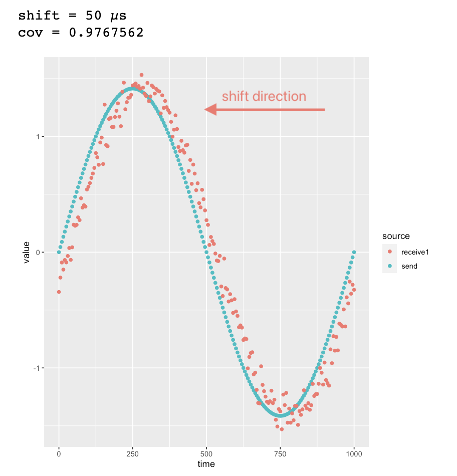

# sut-ps-ta-fall2022
Engineering Probability and Statistics, Sharif University of Technology, Fall 2022

See [here](https://github.com/alirezahabib/sut-ps-ta-fall2022/blob/main/HW3/HWP3.ipynb). The notebook is in Persian and uses R kernel (not Python kernel!) and may not be rendered correctly on GitHub.

